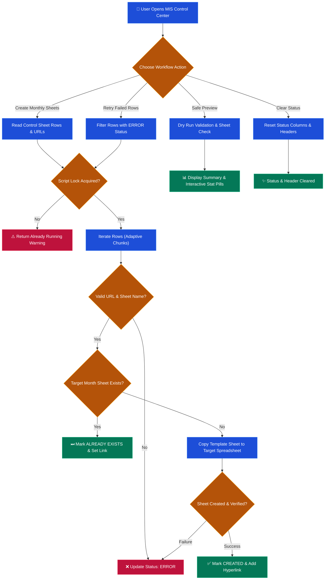

<h1 align="center">Monthly Sheet Manager 📊</h1>

<p align="center">
  
  
  
  
  
</p>

<p align="center">
  A high-performance Google Apps Script automation tool powered by <b>MIS Control Center • K41L3Y</b>, designed to streamline monthly caller sheet generation across distributed spreadsheets.
</p>

---

## ⚡ Workflow Architecture



---

## 🌟 Key Features Chart

| Icon | Category | Feature Name | Description | Key Benefit |
| :---: | :--- | :--- | :--- | :--- |
| 📊 | **Execution Engine** | **Real-Time Progress & Formatted ETA** | Live batch runner displaying 0-100% percentage, current row, & dynamic m/s formatted ETA (`⏱️ ~10m 57s remaining`) | Full transparency on execution time |
| ⚡ | **Batch Performance** | **Adaptive Batch Engine & Idle Timer** | Auto-refreshing safety timer (`refreshSafetyTimer`) with adaptive chunking (5 rows preview, 2 rows create) | Uninterrupted 100% completion across large sheets |
| 🎛️ | **Interactive UI** | **Interactive Stat Pills** | Clickable summary pills (`CREATED`, `EXISTS`, `SKIPPED`, `ERRORS`) with active glowing highlights | Instant row-level log filtering |
| 📋 | **Data Export** | **TSV / Excel 1-Click Copy** | Compact SVG button exporting log details formatted as Tab-Separated Values | Paste cleanly into Excel or Sheets |
| 🎨 | **Design System** | **Glassmorphism & 5px Scrollbars** | High-end frosted glass cards, smooth blurs, and ultra-slim 5px custom scrollbars | Modern Apple-like desktop aesthetic |
| ☀️/🌙 | **Themes** | **Light & Dark Mode** | Instant toggle supporting native Google Sheets Light theme and Midnight Dark theme | High readability in any environment |
| ⚡ | **Automation** | **Direct Auto-Open Sidebar** | Automatically triggers `onOpen()` to load **MIS Control Center** on sheet startup | Zero manual menu clicks needed |
| 🚀 | **Duplication** | **Template Copy Engine** | Clones predefined `Template` sheet to target spreadsheets listed in control sheet | Fast, error-free monthly rollout |
| 🔍 | **Validation** | **Safe Execution Preview** | Dry-run mode validating URLs and target sheets before making changes | Prevents accidental sheet overwrites |
| 🔄 | **Resilience** | **Smart Error Handling & Retry** | Script locks, row-by-row status updates, and 1-click failed row retries | Seamless recovery from network errors |
| 🌐 | **Topology** | **Graphify Codebase Graph** | Interactive AST knowledge graph visualization in [`graphify-out/graphify.html`](./graphify-out/graphify.html) | Total architectural code clarity |

---

## 📂 Project Architecture & File Structure

```
monthly-sheet-manager/
├── Code.gs                   # Single-file bundled Google Apps Script (Ready to paste in Editor)
├── Sidebar.html              # Primary Glassmorphic HTML5/CSS3/JS UI Sidebar
├── appsscript.json           # Apps Script Manifest file
├── README.md                 # Project Overview & Quickstart Guide
├── CONTRIBUTING.md           # Guidelines for contributing
├── CHANGELOG.md              # Revision history & updates
├── LICENSE                   # MIT License
├── graphify-out/             # Codebase Knowledge Graph & Topology
│   ├── graphify.html         # Interactive visual topology graph
│   └── GRAPH_REPORT.md       # Graph structure report & god nodes
└── src/                      # Modular Architecture (Source Files)
    ├── core/
    │   └── Config.gs         # Constants, Header mapping, Menu & Sidebar triggers
    ├── services/
    │   └── SheetProcessor.gs # Core business logic (Create, Preview, Retry, Clear)
    ├── utils/
    │   └── SheetUtils.gs     # Sheet locators, URL parsers & row status updaters
    └── ui/
        └── Sidebar.html      # Glassmorphic HTML5/CSS3/JS UI Sidebar
```

---

## 🚀 Quickstart & Setup Guide

### Option A: Single-File Setup (⚡ Recommended & Quickest)
If you prefer pasting everything into a single file without managing HTML files:
1. Open your Master Google Sheet.
2. Go to **Extensions** → **Apps Script**.
3. Clear the default code in `Code.gs` and copy-paste the entire contents of [`Code.gs`](./Code.gs).
4. Save (💾) and refresh your Google Sheet.

### Option B: Multi-File Setup
If you prefer keeping separate files in Apps Script:
1. Copy [`src/core/Config.gs`](./src/core/Config.gs) content to `Config.gs`.
2. Copy [`src/services/SheetProcessor.gs`](./src/services/SheetProcessor.gs) content to `SheetProcessor.gs`.
3. Copy [`src/utils/SheetUtils.gs`](./src/utils/SheetUtils.gs) content to `SheetUtils.gs`.
4. Create an HTML file named `Sidebar` in the Apps Script editor and copy [`Sidebar.html`](./Sidebar.html) content.

---

## 📄 License
This project is licensed under the [MIT License](./LICENSE).
